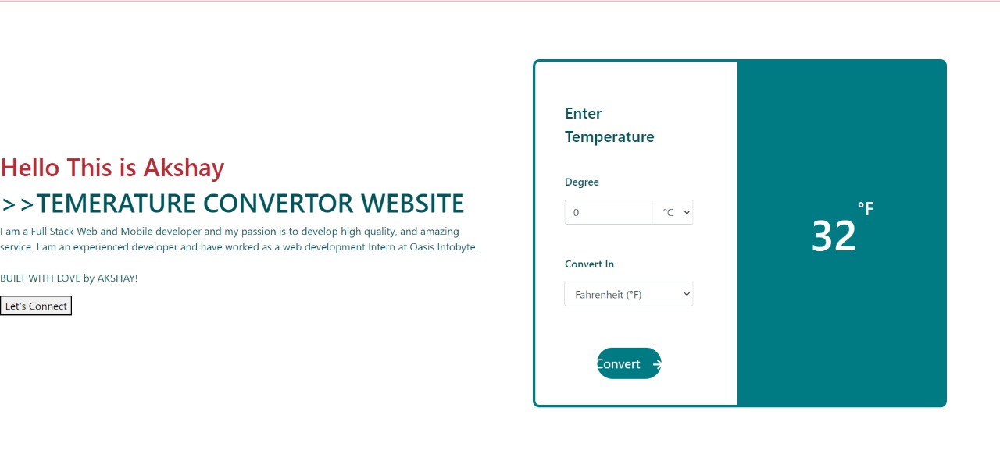

# Temperature Unit Converter

It's a simple website that convert temperatures units from Celsius to Fahrenheit, Kelvin or vice versa. You just have to enter the value and select the output unit type and output will be automatic update as you change the inputs.

       &ensp;
       
 

## Prerequistes

Basics jQuery and bootstrap knowledge.
 
 

## What you'll Learn

- Calculating forumals using JS
- DOM Manipulations
- Realtime Update

---

## Find Me On

<a href="https://instagram.com/akshay_kate_007
">Instagram</a> &ensp;
<a href="www.linkedin.com/in/dev-akshaykate">LinkedIn</a> &ensp;
<a href="https://twitter.com/Dev_AkshayKate">Twitter</a> &ensp;

